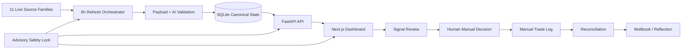
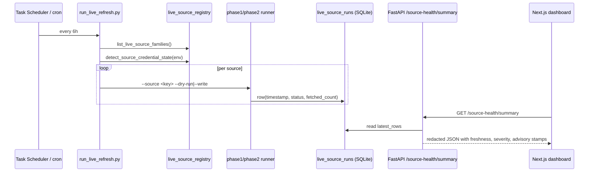

# Sleeping Passenger — Showcase

> A local-first advisory signal review, reflection, and manual-trade
> journal. Reads live source data (Polymarket, GDELT, SEC EDGAR, NewsAPI,
> Event Registry, Etherscan, Grok/xAI, market data, regional filings),
> interprets it with safety-stamped AI, and helps a single operator
> decide, log, and reconcile — never execute.

This document is for recruiters, peers, and anyone curious why this MVP
exists. For setup, see `SETUP.md`. For the runtime story, see `DEMO.md`.
For honest scoring, see `docs/FINAL_SCORECARD.md`.

---

## 1. One sentence

Sleeping Passenger is a single-operator, locally hostable journal that
ingests advisory signals from 11 source families on a 6-hour cadence,
validates every AI interpretation against an explicit safety schema, and
guides the operator through a 13-step **review → reflect → decide → log →
reconcile** loop — with `execution_gate = LOCKED` everywhere.

---

## 2. The problem it solves

There are two failure modes when reviewing financial signals as an
individual:

1. **Noise overwhelms judgement.** Polymarket, news APIs, on-chain
   tokens, SEC filings, AI interpretations all arrive in different shapes
   on different schedules. Without a unifying inbox, the operator looks
   at three monitors and remembers none of it.
2. **Hindsight bias replaces learning.** Without a captured reflection at
   the moment of decision, the operator cannot tell six months later
   *why* they made the call.

This MVP attacks both: a single inbox with source-health honesty, and a
manual journal with reconciliation against outcome.

---

## 3. What the MVP **does**

- Pulls signals from 11 source families with a 6-hour refresh cadence
  (dry-run by default; `--write` is explicit).
- Runs Grok/xAI interpretation on selected payloads with a strict output
  schema (`scripts/ai_output_schema.py`).
- Surfaces a source-health summary so the operator always knows if a
  signal feed is fresh, stale, expired, or never-run.
- Lets the operator validate, discuss, reflect, decide on each signal
  one at a time, manually.
- Lets the operator log manual trades and reconcile outcomes.
- Captures a Moltbook learning journal across signals and reflections.
- Exports every artifact (signals, reflections, trades, reconciliations,
  Moltbook, source health) as CSV.
- Backs up the entire local DB with a single script.

---

## 4. What it **does not** do

- No broker integration. No order placement. No CLOB calls. No wallet
  signing. No automated trading.
- No financial advice. No personalized recommendations.
- No multi-user accounts. No hosted deployment. No public SaaS.
- No "AI decides for you." AI may interpret, summarize, classify, flag,
  validate — never execute.

Safety invariants enforced on every mutating route and AI output:

```
advisory_status          = "ADVISORY_ONLY"
execution_gate           = "LOCKED"
broker_api_called        = false
ai_execution_count       = 0
broker_order_id          = "NONE"
human_execution_required = true
```

If a future model echoes `execution_permission=true`, the AI output schema
silently overrides it to `false` and records the override in
`validation_errors`. See `docs/AI_OUTPUT_VALIDATION.md`.

---

## 5. Core workflow

```
1.  Start backend + frontend
2.  Verify backend / DB / safety health (/health, /db/status, /api/version)
3.  Refresh or inspect live/source signals (6-hour orchestrator)
4.  Review the signal inbox
5.  Inspect a signal detail
6.  Reflect / validate / discuss
7.  Make a manual human decision
8.  Log the manual trade
9.  Reconcile the outcome
10. Learn through Moltbook / Reflection
11. Export / review history
12. Back up the DB
13. Restore safely if needed
```

Each step has a backend endpoint, a frontend route, at least one test, and
a row that lands in SQLite with the safety stamps preserved.

---

## 6. Architecture overview



For the deeper diagrams, see `docs/ARCHITECTURE.md`.

---

## 7. Safety posture

- `ADVISORY_ONLY` stamps on every mutating route response.
- `execution_gate = LOCKED` on every AI output, every refresh run,
  every reconciliation entry.
- `ai_execution_count = 0` is asserted in 100+ tests.
- The orchestrator and the AI schema redact secret-like patterns before
  anything is persisted.
- Frontend has no broker SDK. There is nothing it could call.

---

## 8. Live signals model

| Source family | Adapter | Credentials needed | 6h refresh status |
|---|---|---|---|
| Polymarket | implemented | none | dry-run safe |
| GDELT | implemented | none | dry-run safe |
| SEC EDGAR | implemented | `SEC_USER_AGENT` | dry-run safe |
| NewsAPI | implemented | `NEWS_API_KEY` | dry-run safe |
| Event Registry | implemented | `EVENT_REGISTRY_API_KEY` | dry-run safe |
| Etherscan | implemented | `ETHERSCAN_API_KEY` | dry-run safe |
| Grok/xAI | implemented | `XAI_API_KEY` | dry-run safe; AI output passes through canonical schema |
| Market Data (yfinance) | implemented | none | dry-run safe |
| India (NSE/RBI/SEBI) | implemented | none | dry-run safe |
| Global Filings | partial — ASX live; HKEX/SGX/UK-RNS/ESMA/SEDAR/TDNet placeholder | varies | dry-run safe |
| Asia Disclosure | planned — all placeholders | varies | dry-run safe |

The orchestrator (`scripts/run_live_refresh.py`) defaults to `--dry-run`.
The Windows wrapper (`scripts/windows/refresh_live_signals_every_6h.ps1`)
defaults to `--dry-run`. The cron example in
`docs/LIVE_SIGNALS_SCHEDULING.md` defaults to `--dry-run`. There is no
hidden daemon.

---

## 9. 6-hour refresh model



---

## 10. Screens / pages

| Page | Purpose |
|---|---|
| Dashboard / mission-control | Quick status, next best action, source-health overview |
| Live Signals | Per-source readiness, freshness, credential state (no secrets) |
| Signal Inbox | List of recent normalized signals |
| Signal Detail | Per-signal interpretation, reflect, discuss, decide |
| Manual Trade Log | Log a manual trade against a signal/decision |
| Reconciliation | Reconcile outcome to the manual trade |
| Moltbook | Learning journal across signals and reflections |
| Help / Onboarding | Workflow grouping, safety notes, quick-start |
| Settings | Mock fallback toggle, mode tagline |

---

## 11. Data sources (canonical)

See section 8 above; full ToS posture in `docs/SOURCE_TOS_CHECKLIST.md`.

---

## 12. AI output validation

`scripts/ai_output_schema.py` is the canonical validation layer. Every AI
interpretation payload — Grok/xAI today, any other model tomorrow — passes
through `validate_ai_interpretation_payload()` before persistence.

It enforces:

- known shape (model_name, provider, prompt_version, interpreted_topic,
  narrative_frame, contradiction_flags, confidence_score, summary,
  raw_response, validation_status, validation_errors)
- confidence band [0, 1] with safe rescale of percentage-looking values
- safety-stamp overrides (every attempted `execution_permission=true` is
  silently overridden and audited)
- secret-pattern redaction (`api_key=...`, `sk-...`, `xai-...`, `Bearer ...`)
- `validation_status` ∈ {valid, partial, invalid, not_applicable}

28 tests in `tests/test_ai_output_schema.py` pin the contract.

---

## 13. Testing / validation status

| Layer | Coverage | Evidence |
|---|---|---|
| Backend logic | strong | 2950+ passing pytest, including AI schema, registry, orchestrator |
| Persistence truth | strong | `tests/test_persistence_truth_model.py` |
| Live source runners | strong | `tests/test_live_source_runner_phase{1,2}*.py` |
| AI output schema | strong | 28 tests pinning the safety contract |
| Live source registry | strong | 24 tests pinning all 11 families and credential redaction |
| Refresh orchestrator | strong | 15 tests pinning dry-run, write-explicit, no-secret-leakage |
| Frontend unit tests | partial | Next.js infrastructure present; coverage gaps |
| End-to-end | partial | Backend covers most steps; full Playwright not in this sprint |
| Docker compose | scaffold | `docker-compose.yml` lints; not a full hosted deploy |

---

## 14. How to run locally

```powershell
# Backend
python -m uvicorn scripts.api_server:app --host 127.0.0.1 --port 8000

# Frontend (Node 20+, dependencies pre-installed)
cd frontend
npm run dev

# Smoke check
python scripts/smoke_check.py --api http://127.0.0.1:8000

# 6-hour refresh dry-run
python scripts/run_live_refresh.py --source all --dry-run
```

Full setup in `SETUP.md`. Demo script in `DEMO.md`.

---

## 15. How to demo

1. `python scripts/smoke_check.py` — show health/db/version green
2. `python scripts/run_live_refresh.py --source all --plan-only --json` — show the registry
3. Open the dashboard, walk through the 13-step workflow.
4. Trigger an AI summary on a signal; show `validation_status=valid` in the response.
5. Log a manual trade; reconcile it.
6. Run `python scripts/backup_db.py`; show the backup file land in `runtime/backups/`.
7. Close with a screenshot of `/source-health/summary`.

The full screenshot list is in `docs/SCREENSHOT_CHECKLIST.md`.

---

## 16. What is real vs mock

- **Real backend** at `http://127.0.0.1:8000` when uvicorn is running.
- **Real SQLite** at `runtime/mvp_local.db`.
- **Real live source adapters** for the 8 implemented families. They make
  actual HTTP requests in `--write` mode (subject to credentials and quotas).
- **Real AI output validation** through `scripts/ai_output_schema.py`.
- **Mock fallback** in the frontend (`frontend/src/lib/mockData.ts`) is
  used only when the backend is offline. The UI displays a banner.
- **Placeholders** are marked as such in the source registry and surfaced
  honestly in the source-health summary.

---

## 17. Current limitations

- Single-tenant. The token gate is a shared bearer, not real auth.
- SQLite only. No Postgres implementation yet; migration plan exists.
- No hosted deployment. Docker scaffold exists; hosted plan documented.
- No monitoring beyond logs. Plan exists.
- No frontend e2e in CI. Backend e2e is partial.
- Some live source families are placeholders (asia_disclosure family,
  most of global_filings). They skip cleanly and never claim data.

---

## 18. Next roadmap

| Horizon | Theme |
|---|---|
| 30 days | Screenshots, recorded demo, frontend e2e, AI eval data seed |
| 90 days | Private-beta scaffolding behind a feature flag (auth + Postgres + hosted compose) |
| Not on roadmap | Broker integration, public SaaS, automated trading |

Full breakdown in `docs/ROADMAP_DECISION_DAY_30.md`.

---

## 19. Why this matters

Most "AI for trading" projects either pretend at production-readiness or
quietly grow an execution surface that operators cannot audit. This one
goes the other way: it refuses to execute, makes its safety contract
visible at every level of the stack, and treats source health as a
first-class observable. The journal-first framing is the deliberate
limit.

The product is the *flow*, not the model.
