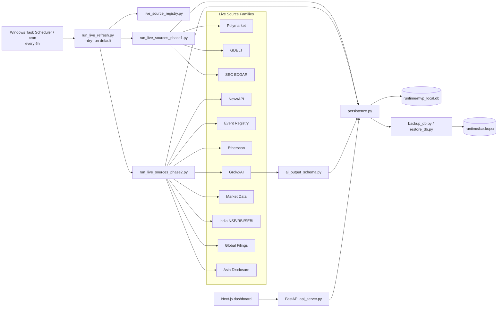
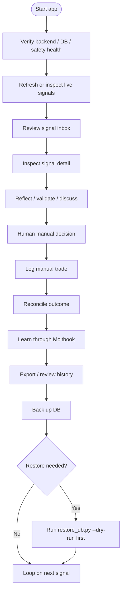
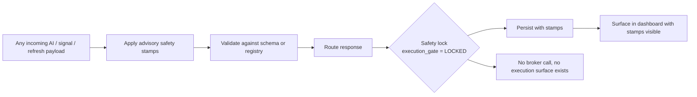
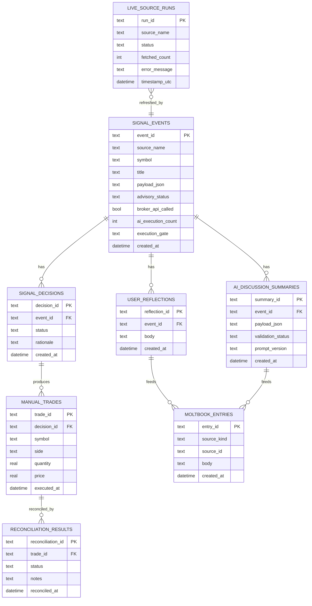
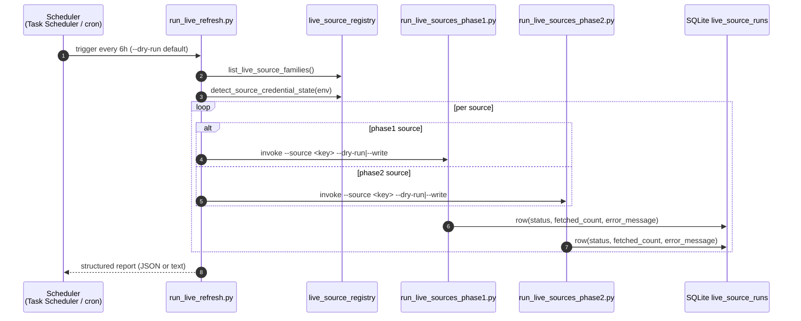
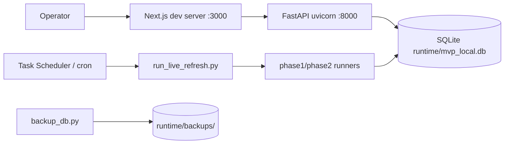

# Architecture

> The technical map of the sleeping-passenger MVP. Paired with `SHOWCASE.md`
> (product story) and `docs/PERSISTENCE_MODEL.md` (data truth model).

---

## 1. System architecture



---

## 2. Canonical workflow



---

## 3. Safety invariant path



Every step asserts:

```
advisory_status          = "ADVISORY_ONLY"
execution_gate           = "LOCKED"
broker_api_called        = false
ai_execution_count       = 0
broker_order_id          = "NONE"
human_execution_required = true
```

---

## 4. Persistence model



Full truth model: `docs/PERSISTENCE_MODEL.md`.

---

## 5. Live signals refresh model



---

## 6. Component map

| Component | File(s) | Responsibility |
|---|---|---|
| API server | `scripts/api_server.py` | FastAPI routes (`/health`, `/api/version`, `/db/status`, `/signals`, `/manual-trades`, `/reconciliation`, `/moltbook`, `/source-health/summary`, `/exports/*.csv`) |
| Signal inbox API | `scripts/signal_inbox_api.py` | signal listing, AI summary, decision/reflection capture |
| Moltbook API | `scripts/moltbook_api.py` | Moltbook learning journal |
| Persistence | `scripts/persistence.py` | SQLite read/write, WAL, busy-timeout, foreign-key hardening |
| AI output schema | `scripts/ai_output_schema.py` | canonical AI payload contract, safety overrides, secret redaction |
| Live source registry | `scripts/live_source_registry.py` | 11 source families, credential state, 6h cadence |
| Refresh orchestrator | `scripts/run_live_refresh.py` | dry-run-safe 6h refresh CLI |
| Phase1 runner | `scripts/run_live_sources_phase1.py` / `live_source_runner.py` | Polymarket / GDELT / SEC EDGAR |
| Phase2 runner | `scripts/run_live_sources_phase2.py` / `live_source_runner_phase2.py` | the other 8 families |
| Source health | `scripts/source_health_summary.py` | per-source severity, category, redacted error text |
| Backup | `scripts/backup_db.py` / `restore_db.py` | DB backup / non-destructive restore |
| Smoke check | `scripts/smoke_check.py` | one-shot health/version/db verification |
| Rate limiter | `scripts/rate_limiter.py` | request-rate protection |
| Frontend | `frontend/src/app/**/*.tsx` | Next.js dashboard, sidebar, signal pages, mock fallback |

---

## 7. What is intentionally **not** present

| Not present | Why |
|---|---|
| Broker SDK | No execution surface. Period. |
| Order placement code | Same. |
| Auto-trading scheduler | Same. |
| Public landing page / marketing site | Not a public product. |
| Real multi-user auth | Out of scope for a local-first MVP (designed in `docs/PRIVATE_BETA_AUTH_DESIGN.md`). |
| Hosted Postgres | Out of scope (planned in `docs/POSTGRES_MIGRATION_PLAN.md`). |
| Hosted deployment | Out of scope (planned in `docs/HOSTED_DEPLOYMENT_PLAN.md`). |
| Always-on refresh daemon | Refresh is operator-driven via cron / Task Scheduler. |
| Per-tick streaming | The 6-hour cadence is the right floor for advisory use. |
| Sport-archetype analogy modules in critical path | They exist as docs and engines for context; the canonical workflow does not require them. |

---

## 8. Deployment topology (local-first today)



For the hosted topology (private beta, when implemented), see
`docs/HOSTED_DEPLOYMENT_PLAN.md`.

---

## 9. Configuration surface

| Source | What | Notes |
|---|---|---|
| `.env` | API keys, `MVP_API_TOKEN`, `MVP_DB_PATH`, `SEC_USER_AGENT` | Never committed |
| `config/llm_provider_config.json` | Grok/xAI provider defaults | Overridable per-call |
| `config/external_data_config.json` | external adapter wiring | n/a for live refresh |
| `config/sources.yaml`, `config/external_adapters.yaml` | signal-source taxonomy | configurable |
| `config/thresholds.yaml` | scoring thresholds | configurable |

---

## 10. Operational guarantees

| Guarantee | Mechanism | Evidence |
|---|---|---|
| Safety stamps cannot be bypassed | `apply_advisory_safety_stamps()` overrides every unsafe field | `tests/test_ai_output_schema.py::test_invalid_payload_never_creates_action_permission` |
| Secrets never reach frontend | Registry returns `configured: bool` only | `tests/test_live_source_registry.py::test_credential_state_redacts_values_completely` |
| Failures are per-source | Orchestrator's `_classify_for_execution()` returns skip-not-fail | `tests/test_live_refresh_orchestrator.py::test_source_failure_does_not_abort_whole_run` |
| Backup is non-destructive | `restore_db.py` writes pre-restore backup before any overwrite | `tests/test_db_backup_restore.py` |
| Persistence is canonical | Single source of truth (SQLite) with documented schema | `docs/PERSISTENCE_MODEL.md` |
