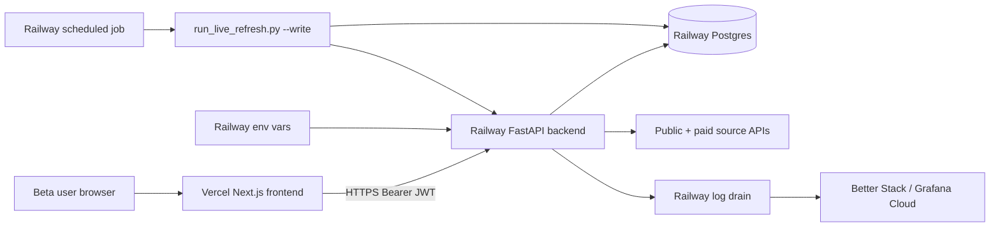

# Hosted Deployment Plan

> **Design only.** Nothing in this document is implemented in the Day 26–35
> sprint. The MVP is **local-first** today. This plan defines the smallest
> hosted footprint that would support a controlled private beta.
>
> Pairs with `docs/PRIVATE_BETA_AUTH_DESIGN.md`,
> `docs/POSTGRES_MIGRATION_PLAN.md`, and `docs/MONITORING_AND_INCIDENTS.md`.

---

## 1. Hosting option comparison

| Option | Pros | Cons | Fit |
|---|---|---|---|
| **Railway** | One-click Postgres, Docker support, free hobby tier, simple secret store, instant logs. | Limited region selection, hobby tier is slow under load. | **Strong for private beta backend.** |
| **Render** | Similar to Railway, web service + worker model, managed Postgres. | Cold starts on hobby tier. | **Strong.** |
| **Fly.io** | Edge deploy, persistent volumes, Postgres add-on, generous free tier. | More ops knowledge needed, Postgres add-on has had reliability issues historically. | Decent for private beta but more dev-ops. |
| **VPS (Hetzner / DigitalOcean / Linode)** | Total control, predictable costs, no platform lock. | Operator owns OS patches, certs, backups, monitoring. | Heavy maintenance for one-operator beta. |
| **Vercel (frontend) + Railway/Render (backend)** | Optimal Next.js DX, hosted backend separated cleanly. | Two providers to manage, env-var sync, edge function caveats. | **Recommended split for private beta.** |
| **Docker Compose on a single VPS** | One server, one `docker compose up`, easy to inspect. | Manual TLS, manual monitoring. | OK for an internal demo, not a private beta. |

### Recommendation

| Phase | Topology |
|---|---|
| **Local showcase (today)** | Docker Compose on the operator's laptop. No public surface. |
| **Internal demo / single-VPS beta** | Single VPS running `docker compose up` (backend + Postgres + Caddy for TLS). |
| **Controlled private beta (3–5 users)** | Vercel for frontend + Railway for backend + Railway-managed Postgres. |
| **Public production** | Out of scope. Revisit with a real ops team. |

---

## 2. Deployment architecture (controlled private beta)



The **frontend never holds secrets** — all paid APIs are proxied through
the backend. `NEXT_PUBLIC_*` is reserved for non-secret config (e.g.
`NEXT_PUBLIC_API_BASE_URL`).

---

## 3. Environment variables

| Variable | Owner | Purpose |
|---|---|---|
| `API_HOST` | backend | bind interface (0.0.0.0 in hosted) |
| `API_PORT` | backend | bind port |
| `ALLOWED_ORIGINS` | backend | comma-separated allowed CORS origins |
| `MVP_API_TOKEN` | backend (local mode only) | local-mode token gate |
| `MVP_ENVIRONMENT` | backend | `local` / `staging` / `production` |
| `DATABASE_URL` | backend (PG mode) | full DSN |
| `DB_BACKEND` | backend | `sqlite` / `postgres` |
| `JWT_ISSUER` | backend (hosted) | auth provider's issuer URL |
| `JWT_AUDIENCE` | backend (hosted) | expected `aud` claim |
| `JWT_JWKS_URL` | backend (hosted) | JWKS endpoint for public key fetching |
| `XAI_API_KEY` | backend | Grok/xAI provider |
| `XAI_API_BASE_URL` | backend | provider base URL override |
| `XAI_MODEL` | backend | model selection |
| `NEWS_API_KEY` | backend | NewsAPI |
| `EVENT_REGISTRY_API_KEY` | backend | Event Registry |
| `ETHERSCAN_API_KEY` | backend | Etherscan |
| `SEC_USER_AGENT` | backend | descriptive UA for EDGAR |
| `LIVE_REFRESH_CADENCE_HOURS` | scheduler | default 6 |
| `RATE_LIMIT_PER_MINUTE` | backend | rate limiter cap |
| `MAX_REQUEST_BYTES` | backend | request size guard |
| `BACKUP_S3_BUCKET` | backend | optional managed backup target |

### Secret rules

- Never in `NEXT_PUBLIC_*`.
- Never committed.
- Never logged. The orchestrator and AI schema already redact patterns.
- Provider dashboard / env-var store only.
- Rotate on suspicion. See `docs/LIVE_SIGNALS_SCHEDULING.md` §8.

---

## 4. Docker Compose (single-VPS topology)

A minimal `docker-compose.yml` template (already scaffolded in this repo)
extended with a Caddy front-end for TLS:

```yaml
# Conceptual sketch — review and test before deploying.
services:
  caddy:
    image: caddy:2
    ports: ["80:80", "443:443"]
    volumes:
      - ./Caddyfile:/etc/caddy/Caddyfile
      - caddy_data:/data
    depends_on: [frontend, backend]

  frontend:
    build:
      context: ./frontend
      dockerfile: ../Dockerfile.frontend
    environment:
      NEXT_PUBLIC_API_BASE_URL: ${NEXT_PUBLIC_API_BASE_URL}
    depends_on: [backend]

  backend:
    build:
      context: .
      dockerfile: Dockerfile.backend
    environment:
      MVP_ENVIRONMENT: production
      DB_BACKEND: postgres
      DATABASE_URL: ${DATABASE_URL}
      JWT_ISSUER: ${JWT_ISSUER}
      JWT_AUDIENCE: ${JWT_AUDIENCE}
      JWT_JWKS_URL: ${JWT_JWKS_URL}
      ALLOWED_ORIGINS: ${ALLOWED_ORIGINS}
      XAI_API_KEY: ${XAI_API_KEY}
      NEWS_API_KEY: ${NEWS_API_KEY}
      EVENT_REGISTRY_API_KEY: ${EVENT_REGISTRY_API_KEY}
      ETHERSCAN_API_KEY: ${ETHERSCAN_API_KEY}
      SEC_USER_AGENT: ${SEC_USER_AGENT}
    depends_on: [postgres]

  postgres:
    image: postgres:16
    environment:
      POSTGRES_USER: ${PG_USER}
      POSTGRES_PASSWORD: ${PG_PASSWORD}
      POSTGRES_DB: ${PG_DB}
    volumes:
      - pg_data:/var/lib/postgresql/data
    restart: unless-stopped

  scheduler:
    build:
      context: .
      dockerfile: Dockerfile.backend
    entrypoint: ["python", "scripts/run_live_refresh.py", "--source", "all", "--dry-run"]
    # Replace with --write only after operator confirmation; consider running
    # this as a cron-style service (e.g. via `ofelia` or `supercronic`) every
    # 6 hours.
    depends_on: [backend]

volumes:
  caddy_data:
  pg_data:
```

---

## 5. Hosted acceptance checklist

The hosted deployment is **done** only when each of these passes:

- [ ] `GET /health` returns 200 with `advisory_status="ADVISORY_ONLY"`.
- [ ] `GET /api/version` returns the deployed git SHA.
- [ ] `GET /db/status` returns Postgres connection healthy + table counts.
- [ ] `GET /source-health/summary` returns all 11 families with redacted
      credential state.
- [ ] JWT auth works (sign-in → request with `Authorization: Bearer ...`
      → 200; expired token → 401).
- [ ] `python scripts/smoke_check.py --api $HOSTED_BASE_URL` passes.
- [ ] No secret value appears in `/health`, `/db/status`, `/api/version`,
      `/source-health/summary`, or any 4xx/5xx error body.
- [ ] Two-user isolation test passes against the hosted instance
      (see `docs/PRIVATE_BETA_AUTH_DESIGN.md`).
- [ ] Backup job runs daily; restore is rehearsed once in staging.
- [ ] Live-refresh job runs every 6 hours; rows land in `live_source_runs`.
- [ ] Logs reach the monitoring drain.
- [ ] HTTPS works; HTTP redirects to HTTPS.
- [ ] CORS allows only the configured frontend origin.

---

## 6. Rollout sequence

| Step | What | Rollback |
|---|---|---|
| 1 | Stand up Postgres (Railway / Supabase / managed). | Tear down PG. |
| 2 | Build backend image; deploy with `MVP_ENVIRONMENT=staging`. | Roll deployment. |
| 3 | Run migration scripts (per `docs/POSTGRES_MIGRATION_PLAN.md`). | Restore from CSV/JSONL export. |
| 4 | Wire auth provider; deploy backend with JWT verification on. | Toggle `MVP_ENVIRONMENT=local`. |
| 5 | Deploy frontend to Vercel; set `NEXT_PUBLIC_API_BASE_URL`. | Roll frontend. |
| 6 | Smoke-check the hosted surface. | Roll all of the above. |
| 7 | Invite the first beta user; rotate their first JWT. | Disable the user. |
| 8 | Monitor for 7 days; iterate. | Sunset deployment if unstable. |

---

## 7. What this plan does **not** cover

- **Pen-testing / security audit.** Required before public launch, not
  before private beta with controlled, trusted users.
- **PCI/SOC compliance.** Not in scope.
- **Multi-region.** Single-region is fine for private beta.
- **Disaster recovery beyond daily backup.** RPO/RTO targets are part of
  the public-launch checklist.
- **Auto-scaling.** Private beta runs at single-instance scale.

---

## 8. Why this is not "shippable" today

| Reason | Mitigation |
|---|---|
| No real auth implemented | Implement per `docs/PRIVATE_BETA_AUTH_DESIGN.md`. |
| No Postgres implementation | Implement per `docs/POSTGRES_MIGRATION_PLAN.md`. |
| No monitoring beyond logs | Implement per `docs/MONITORING_AND_INCIDENTS.md`. |
| No two-user isolation test | Required acceptance gate. |
| No legal review of advisory language | Pair with `docs/LEGAL_PRIVACY_NOTES.md`. |
| No source-ToS clearance | Pair with `docs/SOURCE_TOS_CHECKLIST.md`. |

When all six are green, this plan becomes executable. Until then, the
hosted surface stays as a documented design, and the showcase remains
local-first.
