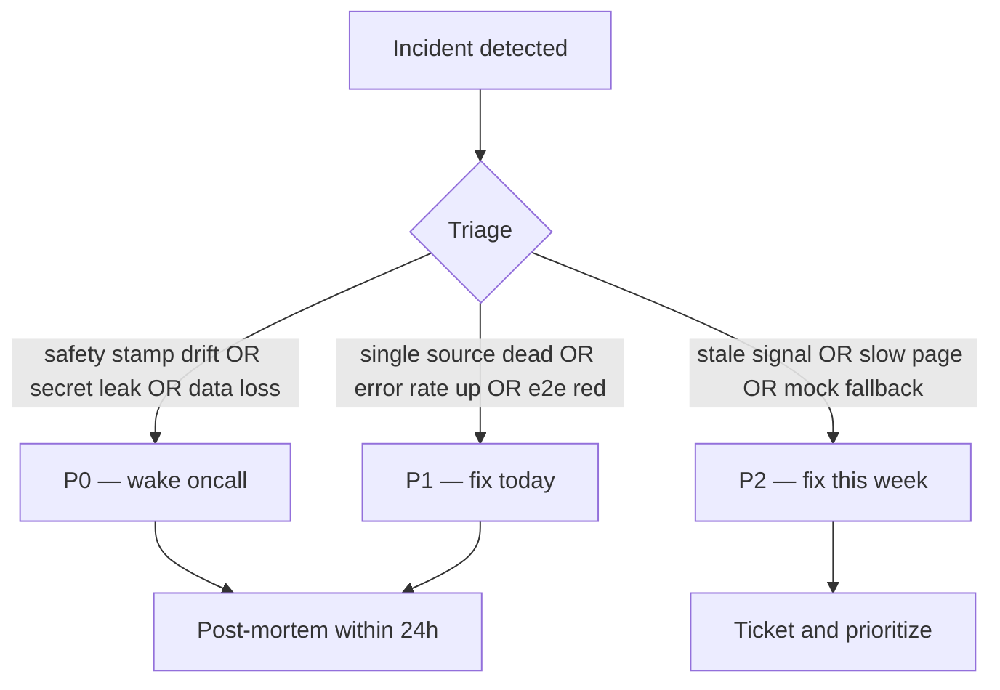

# Monitoring and Incidents

> Operational plan for what to watch, what to alert on, and what to do when
> things go wrong. Pairs with `docs/HOSTED_DEPLOYMENT_PLAN.md`.
>
> **Today, the MVP runs locally.** The current "monitoring" surface is:
> backend logs (stdout), `/health`, `/api/version`, `/db/status`,
> `/source-health/summary`, and the operator's eyes. Everything beyond
> that is part of the private-beta plan.

---

## 1. Today's observability surface

| Source | What it tells you | How to read it |
|---|---|---|
| `GET /health` | Backend up, advisory stamps locked, DB reachable. | `curl http://127.0.0.1:8000/health` |
| `GET /api/version` | Deployed version, git SHA, build time. | `curl http://127.0.0.1:8000/api/version` |
| `GET /db/status` | DB path, WAL mode, busy timeout, foreign keys on, per-table counts. | `curl http://127.0.0.1:8000/db/status` |
| `GET /source-health/summary` | Per-source severity, freshness, redacted error text, advisory stamps. | `curl http://127.0.0.1:8000/source-health/summary` |
| `python scripts/smoke_check.py --api $URL` | One-shot pass/fail for the above. | exit code 0 = pass |
| `python scripts/run_live_refresh.py --source all --dry-run` | Per-source action + advisory stamps. | text or `--json` |
| `logs/live_refresh.log` | Append-only log of every scheduler run. | tail it |

---

## 2. Alert priorities

### P0 — wake somebody up

| Alert | Condition | Why |
|---|---|---|
| Backend down | `/health` fails for 5 min | the product is unavailable |
| DB unavailable | `/db/status` returns 5xx | every read fails |
| Backup failed | scheduled backup job exits non-zero | data is at risk |
| Safety invariant violation | any route returns `advisory_status != "ADVISORY_ONLY"` or `execution_gate != "LOCKED"` | the safety contract is broken |
| Mutating route auth disabled in hosted mode | route processes a mutation without a verified JWT in `MVP_ENVIRONMENT=production` | tenant boundary breached |
| Secret leaked | any endpoint response contains a value matching a secret pattern | rotate immediately |
| Live refresh repeatedly failing for **all** sources | 3 consecutive 6-hour runs with 0 successes | every source pipeline is dead |

### P1 — fix today

| Alert | Condition | Why |
|---|---|---|
| Single source API failure | one source consistently red for ≥ 24 h | data subset is stale |
| Repeated 500 responses | error rate > 1% for ≥ 30 min | something is wrong, not catastrophic |
| Rate-limit spikes | 429 spikes from a single IP | possible abuse |
| E2E failure | nightly e2e suite fails | regression entered |
| Stale source data > 24 h | any implemented source's `freshness_state == "expired"` | scheduler likely not running |

### P2 — fix this week

| Alert | Condition | Why |
|---|---|---|
| Stale signals | `freshness_state == "stale"` | refresh cadence under-running |
| Mock fallback in use | frontend banner active | backend offline somewhere |
| Slow responses | p95 latency > 1 s | UX degraded |
| Source quota warnings | provider quota nearing | switch to dry-run or rotate plan |

---

## 3. What is monitored vs what is **not**

| Today | Status |
|---|---|
| Backend up/down | partially observable (logs + manual `/health`) |
| DB integrity | observable via `/db/status` |
| Source health | observable via `/source-health/summary` and `live_source_runs` rows |
| Safety invariants | enforced in code, asserted in 3000+ tests, not actively alerted |
| User isolation | not applicable (no multi-user) |
| Latency | not monitored |
| Error rate | not aggregated |
| Disk usage on DB | not monitored |
| Backup success | not alerted (operator manually inspects) |
| Live-refresh scheduler | logs to `logs/live_refresh.log`; no alerting |

Private beta requires the missing items above. Today, "monitor" = "look at
the dashboard, run smoke_check, eyeball the log."

---

## 4. Incident response steps

### 4.1 Backend down

1. `curl /health` — confirm.
2. Inspect `logs/api_server.log` or systemd journal.
3. If recently deployed, roll back the deployment.
4. If DB is the cause, see §4.2.
5. Notify any active users (private-beta only).
6. Post-mortem within 24 h.

### 4.2 DB unavailable / DB recovery

1. `curl /db/status` — note `path`, `wal_mode`, `busy_timeout`.
2. Inspect the file (`ls -lh runtime/mvp_local.db*`).
3. If file is corrupted, restore from the most recent backup:

   ```powershell
   # ALWAYS dry-run first.
   python scripts/restore_db.py --source runtime/backups/<timestamped>.db --dry-run
   # Then, if dry-run is clean:
   python scripts/restore_db.py --source runtime/backups/<timestamped>.db --confirm
   ```

4. Verify integrity: `python scripts/smoke_check.py`.
5. Re-enable scheduler.

### 4.3 Disabling a live source

If a single source is misbehaving (paid quota burn, ToS update, repeated
errors):

| Layer | Action |
|---|---|
| **Env** | Unset the API key; the source will skip cleanly. |
| **Orchestrator** | Run `python scripts/run_live_refresh.py --source <others-only>`. |
| **Scheduler** | Update the cron entry / Task Scheduler arguments. |
| **Registry** | (only as a last resort, requires a commit) Edit `_SOURCE_REGISTRY` and mark `not_configured`. |

### 4.4 Rotating API keys

See `docs/LIVE_SIGNALS_SCHEDULING.md` §8. Summary:

1. Rotate at the provider dashboard.
2. Update `.env`.
3. Verify `python scripts/run_live_refresh.py --source <key> --dry-run`.
4. If the leaked key was ever in git history, purge.

### 4.5 Verifying advisory-only safety lock

After **any** incident, before re-opening the service:

```powershell
# Backend must still report ADVISORY_ONLY.
curl -s http://127.0.0.1:8000/health | python -m json.tool

# Smoke check covers /health, /api/version, /db/status.
python scripts/smoke_check.py --api http://127.0.0.1:8000

# Refresh dry-run must still print Advisory: ADVISORY_ONLY | Execution gate: LOCKED.
python scripts/run_live_refresh.py --source all --dry-run

# The full test suite asserts every safety invariant.
python -m pytest tests -q
```

If any of these prints a non-advisory stamp, roll back the deployment
immediately and treat it as a P0.

---

## 5. Per-incident severity routing



---

## 6. Monitoring plan (private beta)

When private beta goes live, the **minimum** stack is:

| Layer | Tool | Purpose |
|---|---|---|
| Logs | Railway / Render log drain → Better Stack or Grafana Cloud | search, alert |
| Uptime | UptimeRobot or Better Stack | external `/health` ping every minute |
| Error tracking | Sentry (Python + Next.js) | grouped 5xx and unhandled exceptions |
| Source health alerting | scheduled job that POSTs `/source-health/summary` to a Slack webhook when severity escalates | per-source visibility |
| Backup alerting | scheduled job that checks backup recency | data at rest |
| Latency tracking | Sentry performance OR a tiny Prometheus side-car | UX |

This is a small footprint — appropriate for 3–5 beta users, not 3,000.

---

## 7. What gets **automatically** verified by the existing test suite

The test suite already enforces non-trivial pieces of the safety contract:

| Test | What it locks |
|---|---|
| `tests/test_api_token_gate.py` | mutating routes require auth in token mode |
| `tests/test_health_extended.py` | `/health` payload shape and advisory stamps |
| `tests/test_persistence_truth_model.py` | DB canonical truth contract |
| `tests/test_security_middleware.py` | security headers present |
| `tests/test_sqlite_hardening.py` | WAL + busy timeout + foreign keys |
| `tests/test_db_backup_restore.py` | restore is non-destructive by default |
| `tests/test_ai_output_schema.py` | AI output never grants execution |
| `tests/test_live_source_registry.py` | no secret leaks, all 11 families present |
| `tests/test_live_refresh_orchestrator.py` | refresh is dry-run by default |
| `tests/test_no_execution_policy_config.py` | refusal posture sticky |

Each of these is a guard rail. CI failures here should treat as P0
regardless of context.

---

## 8. Incident communication

For private beta, every P0 needs:

- Acknowledged by oncall within 15 minutes
- Status update to affected users within 1 hour
- Resolution within 24 hours OR scoped workaround
- Public-facing post-mortem within 7 days

For local-first (today): there is no "users" to notify. The operator
inspects, fixes, and re-runs.

---

## 9. What this plan deliberately omits

- No SLOs / SLAs. Private beta is best-effort.
- No paging rotation. The operator is on call.
- No formal incident command. The operator is the incident commander.

These omissions are honest: a one-operator MVP does not need a 24/7
rotation. A real private beta with paying users *would* — that is part of
the public-launch readiness gate, not this sprint.
