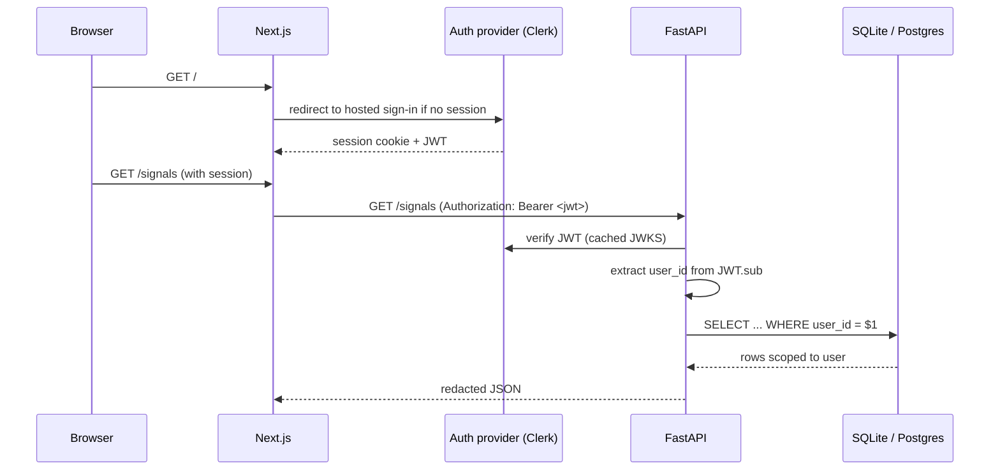

# Private Beta — Auth and User Isolation Design

> **Design only.** Nothing in this document is implemented in the Day 26–35
> sprint. The goal is to make the gap between today's local-token gate and a
> real private-beta auth model explicit, concrete, and reviewable.
>
> Do not ship private beta before this is implemented, tested, and reviewed.

---

## 1. Current auth state

The MVP today ships with a **single shared bearer token** (`MVP_API_TOKEN`):

- Gate is enforced in `scripts/api_server.py` via a request middleware.
- The same token authorizes every mutating route.
- There is no users table. No login flow. No session expiry. No role.
- The frontend reads `NEXT_PUBLIC_API_TOKEN` if present and includes it on
  every request.
- This is **acceptable for a local single operator** and only that.

### Why the score remains ~4/10

| Dimension | Today | Score reasoning |
|---|---|---|
| Multi-user identity | none | A shared token cannot identify who acted. |
| Session management | none | Tokens do not expire; there is no revoke list. |
| Per-user data isolation | none | Every row in `manual_trades`, `reflections`, `moltbook` is owned by "the operator." |
| Role-based access | none | Admin / read-only / operator distinctions do not exist. |
| Privilege boundary at the DB layer | none | All queries are global. |

Acceptable for the *current* product identity (local, single operator).
Unacceptable the moment a second user touches the system.

---

## 2. Private beta target

When the product graduates to "a small number of controlled external users":

- Each user logs in with a real identity (email + password OR OAuth /
  magic-link).
- Each user has an isolated view of their **journal artifacts** (manual
  trades, reflections, decisions, AI summaries, reconciliations,
  Moltbook).
- Each user can read shared source / signal data; they cannot read
  another user's journal.
- Sessions expire; tokens can be revoked.
- The hosted backend never embeds secrets in the frontend.
- An admin role can inspect source health and run refresh, but cannot read
  user journal content.

### Concrete acceptance criteria

```
Private_Beta_Auth_Done =
    two_distinct_test_users_cannot_read_each_others_journal_data
    ∧ login_session_required_in_hosted_mode
    ∧ local_mode_still_works_with_MVP_API_TOKEN
    ∧ every_mutating_route_scoped_to_request.user_id
    ∧ e2e_test_covers_user_isolation
    ∧ no_secrets_in_frontend
    ∧ token_revocation_supported
```

---

## 3. Auth provider options

| Option | Pros | Cons | Fit for this MVP |
|---|---|---|---|
| **Clerk** | Hosted UI, magic link, social, easy session, JWT verification on the backend, free dev tier. | Vendor lock, $$$ above hobby tier. | **Strong fit for closed private beta** — minimal time-to-secure, good UX. |
| **Auth.js (NextAuth)** | Free, owns the session in the Next.js app, many providers, mature. | Backend JWT verification requires a separate library or shared secret; less integrated with FastAPI. | Decent fit — more work than Clerk to plug FastAPI. |
| **Supabase Auth** | Free tier, comes bundled with Supabase Postgres which is a clean migration target. | Vendor lock; couples auth to one DB. | **Strong fit if Postgres choice is Supabase.** |
| **Custom JWT** | No vendor. Total control. | More code, more attack surface, password reset / email flows to build. | Avoid unless we have hard reasons. |
| **Reverse-proxy basic auth (Caddy / nginx)** | Trivial to deploy. | Single shared password, no per-user data isolation, no logout. | **Only for an internal demo VPS**, not a private beta. |

### Recommendation

**Clerk for the first private beta, with the option to migrate to Supabase
Auth if/when we move the DB to Supabase Postgres.**

Reasoning: minimal time to a hardened login UX, JWT verification on FastAPI
is well-documented, free dev tier covers private-beta scale, and the JWT
contains a stable `sub` we can use as `user_id`. Migrating later means
re-issuing tokens, not rewriting the auth model.

---

## 4. Recommended design



Backend changes:

1. New `verify_request_jwt` dependency in `scripts/api_server.py` that:
   - In hosted mode (`MVP_ENVIRONMENT in {staging, production}`): verifies
     the incoming JWT against the provider's JWKS, extracts `sub` as
     `user_id`, and injects it into the request scope.
   - In local mode: bypasses JWT verification, treats the requester as a
     fixed `LOCAL_OPERATOR_USER_ID` (e.g. `"local"`).
2. Every existing FastAPI route that touches a user-owned table is rewritten
   to pull `user_id` from request scope and inject it into the query.
3. The token gate (`MVP_API_TOKEN`) is preserved for local mode and as a
   defense-in-depth fallback in hosted mode (per-environment toggle).

---

## 5. Database changes

### Tables that need `user_id`

| Table | Why |
|---|---|
| `manual_trades` | Each trade is private to the operator. |
| `signal_decisions` | Decision rationale is private. |
| `user_reflections` | Reflection bodies are private. |
| `ai_discussion_summaries` | AI conversation context is per-user. |
| `reconciliation_results` | Outcome attribution. |
| `moltbook_entries` | Learning journal is intensely personal. |
| `export_logs` (if added) | Audit trail of who exported what. |
| `user_settings` (if added) | Per-user prefs (theme, mock fallback toggle, refresh cadence). |

### Tables that remain shared

| Table | Why |
|---|---|
| `signal_events` | Same source data for everyone. |
| `live_source_runs` | Source health is system-wide. |
| `global_securities` | Security master is shared. |
| `global_security_aliases` | Same. |
| Source-registry persistence (if added) | System config, not user data. |

### Tables that need a new `users` table

```sql
CREATE TABLE users (
  user_id      TEXT PRIMARY KEY,        -- equals JWT.sub
  email        TEXT,
  display_name TEXT,
  created_at   DATETIME NOT NULL,
  is_admin     INTEGER NOT NULL DEFAULT 0,
  is_active    INTEGER NOT NULL DEFAULT 1
);
```

---

## 6. Security rules

For every user-scoped query:

```
∀ row ∈ UserOwnedTables:
    row.user_id == request.user_id
```

No user should ever read another user's manual trades, reflections, or
Moltbook entries. The simplest enforcement is in the persistence layer:
each `select_*` helper accepts a required `user_id` argument; missing it is
a programmer error that fails loudly.

### Additional rules

- Mutating routes require an authenticated session; the `MVP_API_TOKEN`
  fallback is opt-in per environment (default OFF in hosted mode).
- Admin routes (e.g. `/source-health/admin/...`) require `is_admin = 1`
  AND a recent session.
- The hosted refresh job runs under a system identity, NOT a user identity.
  It can read/write `signal_events` and `live_source_runs`; it cannot
  read user journal tables.
- Session JWTs are verified on every request (with JWKS cached locally for
  ≤ 24h). No "trust on first use."
- Rate limits are applied per-user (today they are per-IP via
  `scripts/rate_limiter.py` — that already exists and can be extended).

---

## 7. Migration plan

The migration is **additive** and **non-destructive** for the local-first
mode:

| Step | What | Rollback |
|---|---|---|
| 1 | Add `users` table; insert a `local` user. | drop table |
| 2 | Add nullable `user_id` columns to every user-owned table. | drop columns (SQLite needs table rebuild; backup first). |
| 3 | Backfill `user_id = 'local'` for every existing row. | reset column to NULL. |
| 4 | Add an index on `(user_id, created_at)` for every user-owned table. | drop index. |
| 5 | Update every read/write helper in `scripts/persistence.py` to accept and require `user_id`. | revert commit. |
| 6 | Update every FastAPI route to inject `user_id`. | revert commit. |
| 7 | Add `verify_request_jwt` dependency, gated by `MVP_ENVIRONMENT`. | env-flag off. |
| 8 | Update frontend to handle sign-in redirect in hosted mode. | feature flag off. |
| 9 | Make `user_id` non-null and add a CHECK; backfill verified before. | drop CHECK. |
| 10 | Write isolation tests (two test users, cross-read attempts denied). | n/a. |
| 11 | Write e2e covering full hosted-mode flow. | n/a. |
| 12 | Update frontend auth state handling. | n/a. |

---

## 8. Acceptance criteria

Private-beta auth is **done** only when:

- [ ] Two test users (`u1`, `u2`) exist.
- [ ] `u1` logs in via the hosted auth provider, gets a JWT.
- [ ] `u1` cannot read any row owned by `u2`. Verified by:
  - direct API call with `u1`'s JWT trying to GET a `u2`-owned trade
  - same for reflections, Moltbook, reconciliation
- [ ] `u1`'s session expires after the configured TTL; expired token is
      rejected with a clear error.
- [ ] Admin role can read source health but **not** user journal content.
- [ ] Local mode still works without any JWT — `MVP_API_TOKEN` carries the
      old behaviour, scoped to the `local` user.
- [ ] Every mutating route is covered by an isolation test.
- [ ] No secret (`XAI_API_KEY`, `NEWS_API_KEY`, `MVP_API_TOKEN`, JWT
      signing secret) is bundled into the frontend build.
- [ ] An e2e test in CI exercises a two-user isolation scenario.
- [ ] The frontend redirects unauthenticated users to the hosted sign-in.
- [ ] Token revocation works (revoked token gets 401 immediately).

---

## 9. Why the auth score remains ~4/10 *after* this sprint

This document is **design**, not **implementation**. The score will move
only when the migration plan in §7 is executed, the acceptance criteria
in §8 are met, and isolation tests are green.

Until then:

- Auth score: 4 (local token gate only)
- User-isolation score: 1 (single tenant)
- Private-beta readiness: design-complete, implementation-pending.

---

## 10. Warning

**Do not ship private beta before this design is implemented and tested.**

The cost of shipping early is severe: a single missed `WHERE user_id = ?`
clause becomes a data-leak headline. The mitigation is to make `user_id`
a required argument on every persistence helper, which forces a callsite
audit at compile-time-equivalent (pyright / type hints).

See `docs/MONITORING_AND_INCIDENTS.md` for the incident path if isolation
is ever breached.
